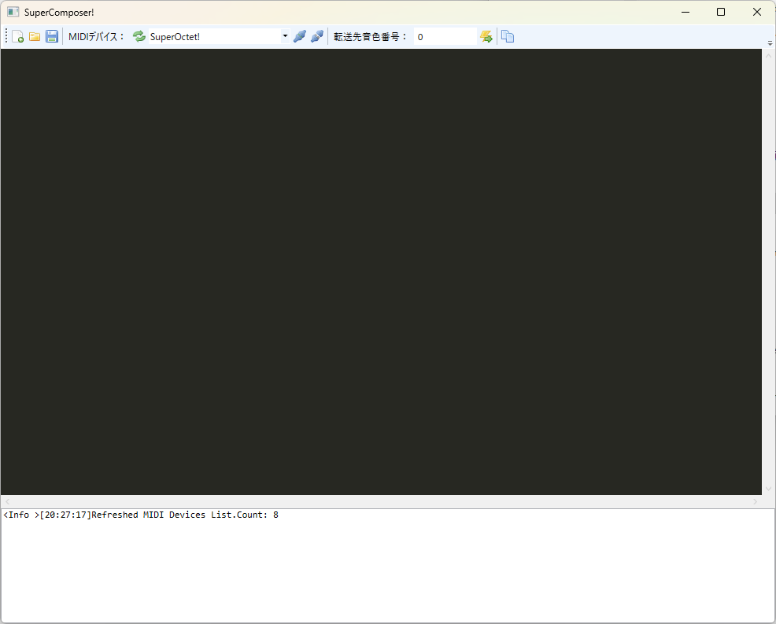
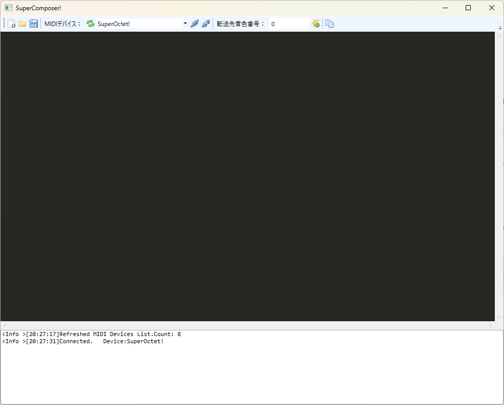
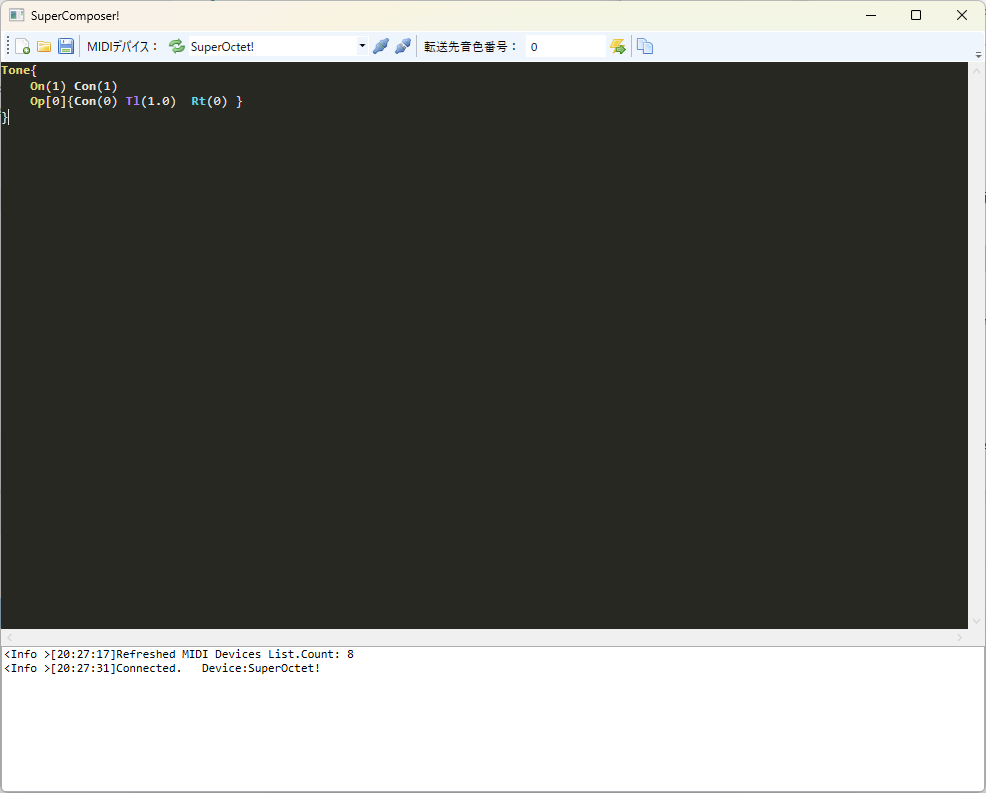
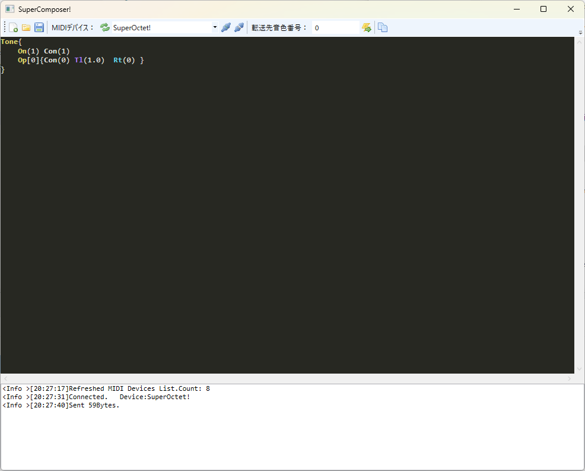
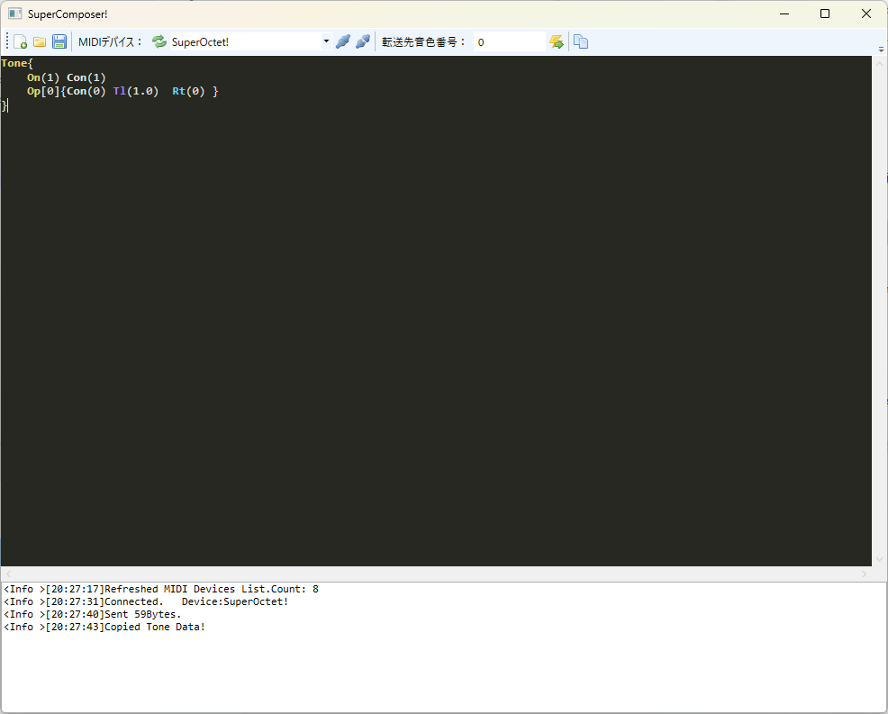
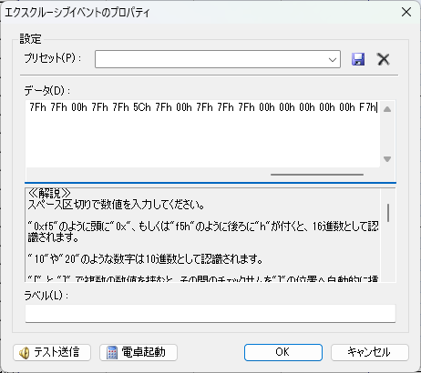
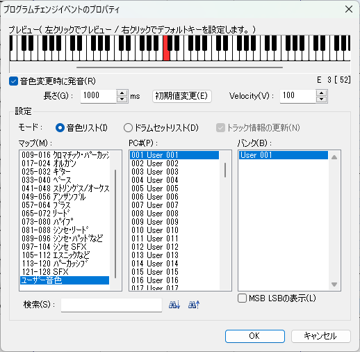

# 音色を作る

この項では本音源でユーザ音色を使用する手順について記述します。

## 音色エディタの使い方



(../download.md)から音色エディタをダウンロードし起動します。

本音源を接続した状態でMIDIデバイスの更新ボタンを押し、コンボボックスから「SuperOctet!」を選択してください。
その状態で横の接続ボタンを押すと次の画像のように音源と接続されます。

!!! note inline end "情報"

    本音源は複数のソフトウェアから同時に使用することができません。音色作成をしながら打ち込みを行う場合は各自MIDI-OXやLoopMIDIを用いて環境を構築する必要がありますが本項では解説しません。



接続しなくても音色自体は作成可能ですが接続することで本ソフトウェアから音色転送が可能になります。
後述するDominoにシステムエクスクルーシブを書き込む場合にはこの操作は必要ありません。

次に、音色を記述します。記述方法については音色エディタに同梱の書き方マニュアルを参照してください。今回は単純な正弦波とします。

```text
Tone{
	On(1) Con(1)
	Op[0]{Con(0) Tl(1.0)  Rt(0) }
}
```



記述ができたら上ツールバーの転送ボタン(雷のボタン)を押して転送できます。
この時に転送先の音色番号(0~127)が指定されていないとエラーになりますので指定してください。
転送できると次の画像のように下にログが出ます。



また、作成した音色のエクスクルーシブをクリップボードにコピーすることもできます。
その場合は音色作成後に音色番号を指定したうえでコピーボタンを押します。



## ユーザ音色を使用する

Dominoでユーザ音色を使用する手順を記述します。
あらかじめ音色定義ファイルを導入していることが前提になります。

ほかのデータがない曲の先頭に先の手順でコピーしたエクスクルーシブを挿入します。

正弦波の例では次のようになります(音色番号0)

```
F0h 43h 10h 4Ch 09h 00h 00h 00h 53h 50h 52h 54h 00h 01h 01h 30h 00h 7Fh 7Fh 00h 00h 00h 00h 00h 00h 00h 00h 00h 00h 00h 00h 00h 02h 00h 01h 00h 00h 00h 00h 7Bh 7Fh 7Fh 7Fh 7Fh 00h 7Fh 7Fh 5Ch 7Fh 00h 7Fh 7Fh 7Fh 00h 00h 00h 00h 00h F7h
```


転送後にプログラムチェンジからユーザ音色を指定することで使用することができます。
ここでの音色番号はエディタで指定したものですが、Dominoの定義ファイルは1-Originとなっているため適宜読み替えてください。


以上の手順によりユーザ音色を使用することができます。