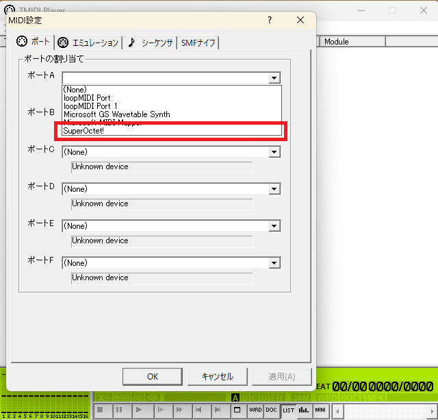
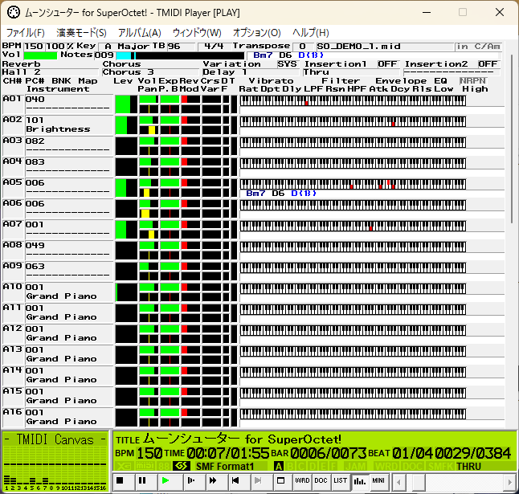

# PCで使う

この項ではPCで本音源を使用する手順について記述します。

MIDIシーケンサのDominoとプレーヤーのTMIDI Playerでの使用手順それぞれを記述します。

以前の使い方ガイドでPCに接続されており適切に音量設定がされていることが前提です。

!!! danger inline end "警告"
    本音源はかなり発熱します！

    熱破壊の恐れがあるため使用環境にはご注意ください

!!! warning inline end "注意"
    本音源は複数のアプリケーションから同時に開くことができません！

    どうしても同時に使用したい場合は別途loopMIDIやMIDI-OXを組み合わせてください。

    なお、この手順については解説しません。

## Dominoで使う

Dominoの導入手順については省略します。

1. [ダウンロード](../download.md)からDominoの定義ファイルをダウンロードします

2. Dominoを開き、「環境設定」→「MIDI-OUT」を選択します

3. ポートAのデバイスを「SuperOctet!」、音源を「すーぱーおくてっと！」にしてOKを押します

4. 適当なノートを置いて音が出ることを確認してください

これでDominoで本音源をお使いいただけます。

## TMIDI Playerで使う

TMIDI Playerの導入手順については省略します。

1. 「オプション」→「MIDI設定」から設定画面を開きます

2. 「ポート」のタブを選択しポートAに「SuperOctet!」を指定しOKを押します

3. あとはお好みのMIDIをドラッグアンドドロップで再生することができます

!!! note inline end "情報"

    「エミュレーション」タブの設定はしない方が良いです。

