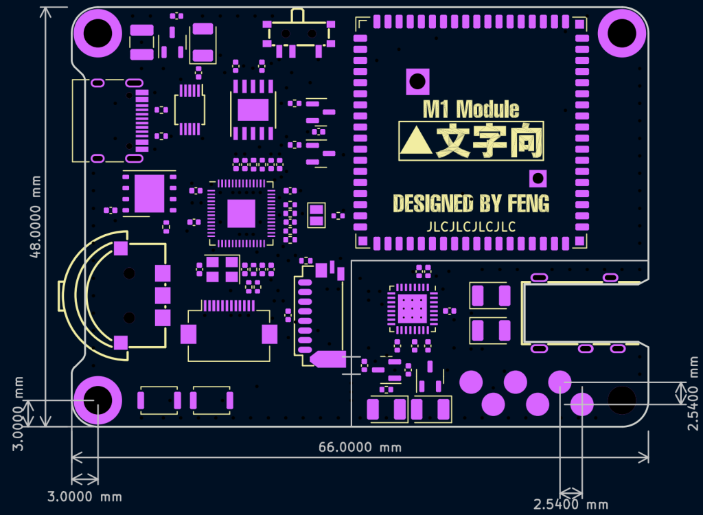
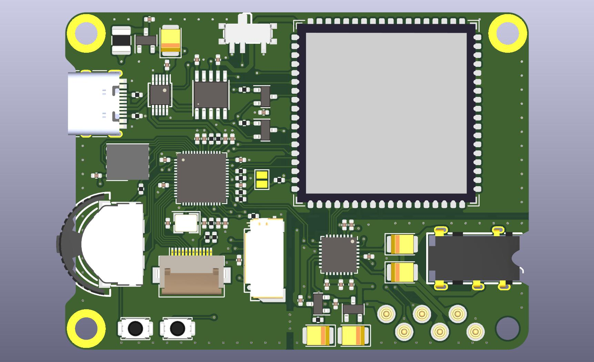
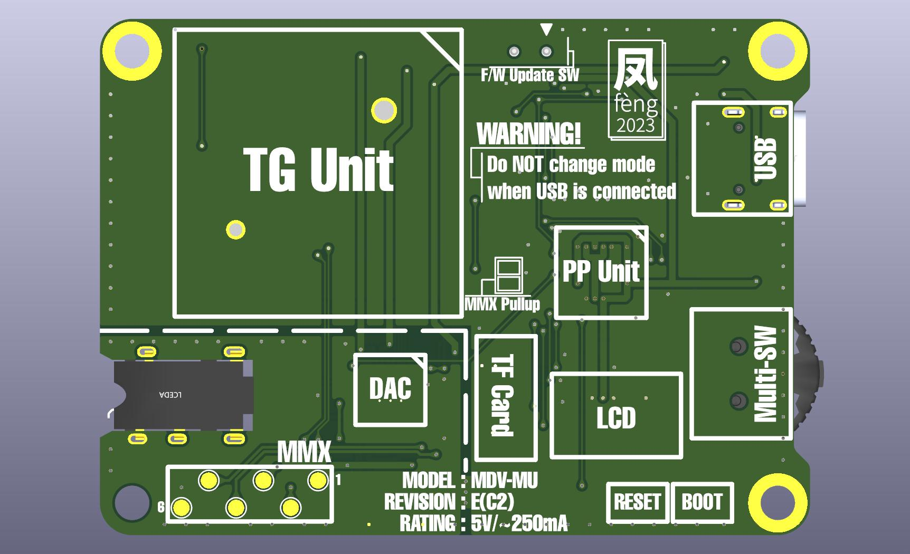

# ハードウェア仕様

この項ではハードウェアの仕様について記述します。

## 主な使用コンポーネント

|項目               |使用部品       |備考                     |
|-------------------|---------------|-------------------------|
|波形生成プロセッサ |Kendryte K210  |600MHz2コアRV64GC        |
|周辺制御プロセッサ |RP2040         |133MHz2コアCortexM0+     |
|DAC                |TLV320DAC3101  |S/N比:95dB Fs=8~192kHz|

## 開発環境

使用OS:Ubuntu 22.04

### Kendryte K210

Standalone SDK

### RP2040

pico-sdk

## 寸法

## 基板図

### 表

### 裏

