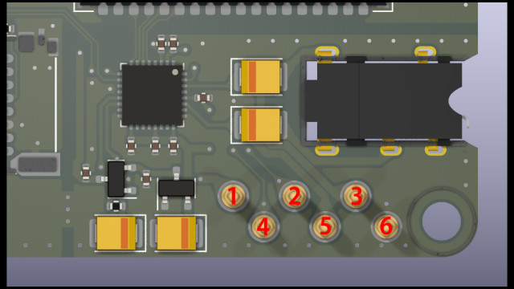

# MMXについて

この項ではMMX(Multi Module eXtension)の物理・論理的仕様について記述します。

## 物理的仕様

図に示すピン番号と信号名の対応を次に示します。

|ピン番号|機能(表)  |機能(裏) |備考                   |
|--------|----------|---------|-----------------------|
|1       |VBUS      |VBUS     |5V電源                 |
|2       |MMX_SDA   |MMX_SDA  |**3.3Vレベル**         |
|3       |AUDIO_LOUT|AUDIO_LIN|バイアス1.65V          |
|4       |MMX_SCL   |MMX_SCL  |**3.3Vレベル**         |
|5       |AUDIO_ROUT|AUDIO_RIN|バイアス1.65V          |
|6       |GND       |GND      |                       |

!!! danger inline end "警告"

    電源電圧(VBUS)は5Vですが信号線は3.3Vレベルです、絶対に5Vレベルの信号を入力しないでください！

音声信号は裏から入力し、ミキシングしたうえで表に出力します。

## 論理的仕様

データの通信にはI2Cプロトコル(@400kHz)を使用し、MIDIデータをやり取りします。

スレーブデバイスは起動時に10h~20hの範囲で開いているスレーブアドレスを検索し空いているアドレスを自局アドレスに設定します。

マスターは起動後十分時間が経ってからアドレス検索をし、正しい応答があったデバイスをスレーブとして登録します。

!!! note inline end "情報"

    アドレスの自動割り当てが不要な場合はジョグを押し込みながら起動するとアドレスが12hに固定されます