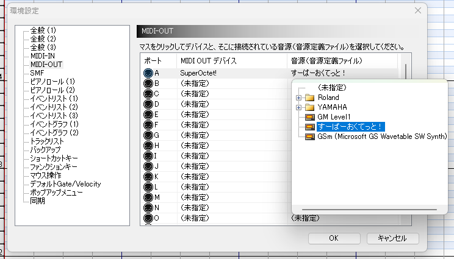
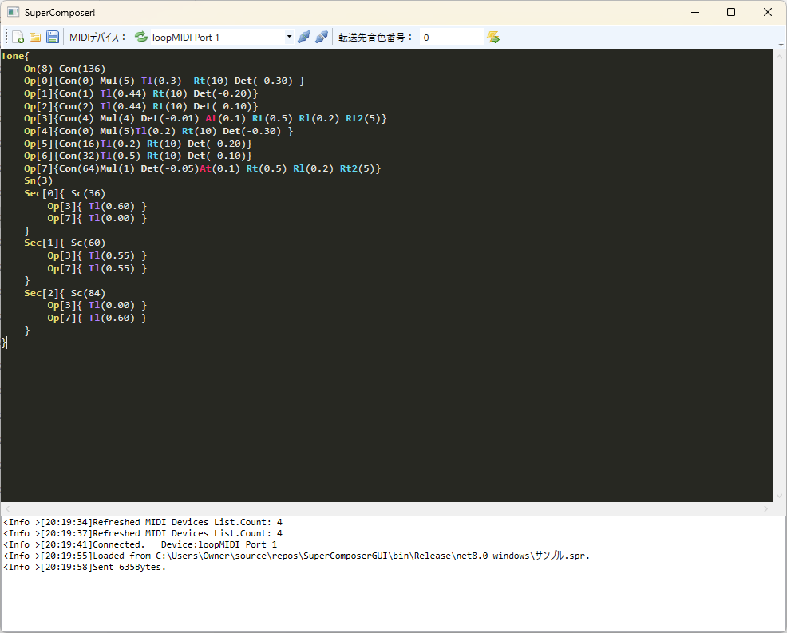

# ダウンロード

## Domino定義ファイル

[Domino音源定義ファイル 1.05](files/feng_SO.xml)

リンクを右クリックし、「名前を付けてリンクを保存(Edgeの場合)」からxmlファイルをDominoのModuleフォルダに保存してください。

Dominoを開き、「環境設定(F12)」から音源を指定してください。

## ファームウェア

### Stable(安定板)

出荷時のファームウェアです。このファームウェアを書き込む必要はありません。

[波形生成プロセッサFW 1.2.0](files/fw/TG120.bin)

[周辺制御プロセッサFW 0.1.9](files/fw/PP019.uf2)

### Experimental(開発版)

Stableとの違いは次のとおりです。

- 開発中バージョンのため動作に問題がある可能性があります

- ボイスアサイナのアルゴリズムを変更しました

- ユーザー音色が使用可能です

- 各種クロックを高速化しモタりを軽減しました

[波形生成プロセッサFW 1.3.5](files/fw/TG135.bin)

[周辺制御プロセッサFW 0.3.5](files/fw/PP035.uf2)

## ソフトウェア

### 音色エディタ(アルファ版)

**Experimental版のファームウェアで**使用可能なユーザー音色のエディタです。

超アルファ版につき見て使い方が分かる人向けです。

[SuperComposer GUI 20240319版](files/SuperComposerGUI_20240319.zip)

