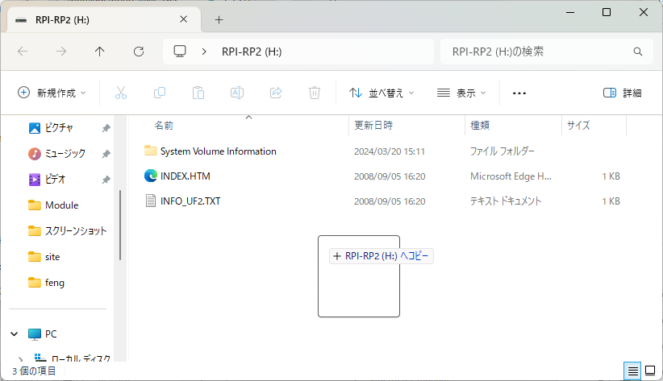

この項では本音源のファームウェアを更新する方法を説明します。

## はじめに

本音源は波形生成プロセッサ(Kendryte K210)と周辺制御プロセッサ(RP2040)の二つのマイコンで構成されています。
そのため、本音源のファームウェアを更新するにはそれぞれに適切なファームウェアを書き込む必要があります。

!!! note inline end "なぜマイコンを二つにわけたのかについて"

    せっかくなので何故マイコンを二つに分けたのかを書いておきます。

    開発初期にはDIN5ピンのケーブルで接続するいわゆる「普通のMIDI」を使用しており、マイコンもKendryte K210一つでした。
    しかし、小型化をするにあたってDIN5ピンのコネクタは大きすぎたためUSB-MIDIを採用することになりました。TRS-MIDIという3.5mmのイヤホンジャックと同じ端子を用いた規格もありましたが次の理由から採用しませんでした。

    - ピン配置がバラバラの場合がある
        - ほぼ統一されたようですがたまに異なるピン配置の機器が存在します
    - 電力の供給が別途必要
        - DIN5ピンと流れる信号は全く同じなので電力は別に供給する必要があります
    - イヤホンジャックと間違える可能性
        - 同じコネクタが2つあるのはミスのもとになり得ます
    - スペース的制約
        - イヤホンジャックは意外と奥行き方向にスペースが必要です

    そのため、本音源はUSB-MIDIを使用することにより上のすべての問題を解決しようと試みました。
    USB-Cコネクタであれば背も低く、裏表を気にしなくてよいという利便性も得られます。

    しかし、問題点として波形生成プロセッサはUARTはあってもUSBペリフェラルは内蔵していませんでした。そのため何らかのICを外付けしてUSB-MIDIに対応させる必要があります。この時候補に挙がったのが次のものです。

    - [ATMEGA32U4](https://www.microchip.com/en-us/product/ATmega32U4)
        - Arduino Leonardoなどでお馴染みAVRマイコン
        - 性能のわりに高すぎる(640円)ため見送り
    - [RP2040](https://www.raspberrypi.com/documentation/microcontrollers/rp2040.html)
        - 安くて高性能
        - QSPIのFlashが外付けだったりコンデンサがたくさん必要だったりで周辺部品が多め
    - [CH345T](https://www.wch-ic.com/products/CH345.html)
        - CH340(USB-シリアル変換IC)などでお馴染みWCH製
        - 多分中身は8051とかのマイコン
        - USB-MIDI Bridgeとかいうほしいものそのまんまな素晴らしい(ように見える)石

    最初(Rev.A)ではCH345Tを採用しました。これはUSBを2ポートのMIDIに変換するICで、周辺回路は12MHzの水晶だけです。「なんて便利な石なんだ！」と思って調子に乗り20個ほど注文しましたが実際には使い物になりませんでした。

    理由は単純で、「システムエクスクルーシブメッセージに対応していない」からです。
    何も流してこないのであればまだ対処のしようがありました。しかし、実際にはメッセージを破壊した状態で送ってくるので手が付けられませんでした。

    そのため、次のRev.BからはRP2040をUSB-MIDI変換ブリッジとして使用しています。周辺部品が結構多めで、USBだけ担当させるのは勿体ないと感じたので液晶をつけたりボタンをつけたりSDカードスロットをつけたり(F/W未実装)と機能がゴテゴテと増えていき今に至ります。

## 波形生成プロセッサのファームウェア更新方法

### モード切り替え

まず、波形生成プロセッサのファームウェアを更新するためにモードを切り替えます。

!!! danger inline end "警告"

    モードの切り替えは**必ずUSBケーブルを抜いた状態で**行ってください！

    モードの切り替えスイッチは内部でUSBのバススイッチの制御に使用しておりスイッチを操作することで物理的に経路を変更しています。

    **ケーブルが刺さった状態での変更は予期しない不具合に繋がります！**


波形生成プロセッサのファームウェアを書き込むためには画像下のスイッチの位置に合わせます。

裏には▲でポジションを示す記号がありますので参考にしてください。

ここでは2通りの方法を説明します。

- Ubuntu + kflash
    - 作者はこれを使用

- Windows + kflash_gui
    - GUIで書き込みを行う

いずれも書き込むファームウェアは`tg.bin`とします。

### Ubuntu + kflash

`Python`と`pip`をインストールしていない場合はインストールします。

```bash
$ sudo apt install python3 python3-pip
$ python3 -v
Python 3.10.12
```

次に書き込みツールの`kflash`をインストールします。

```bash
$ sudo pip3 install kflash
Collecting kflash
Downloading kflash-1.1.6-py3-none-any.whl (49 kB)
━━━━━━━━━━━━━━━━━━━━━━━━━━━━━━━━━━━━━━━━ 49.0/49.0 KB 2.6 MB/s eta 0:00:00
Collecting pyserial>=3.4
Downloading pyserial-3.5-py2.py3-none-any.whl (90 kB)
━━━━━━━━━━━━━━━━━━━━━━━━━━━━━━━━━━━━━━━━ 90.6/90.6 KB 5.9 MB/s eta 0:00:00
Collecting pyelftools>=0.25
Downloading pyelftools-0.31-py3-none-any.whl (180 kB)
━━━━━━━━━━━━━━━━━━━━━━━━━━━━━━━━━━━━━━━━ 180.5/180.5 KB 12.9 MB/s eta 0:00:00
Installing collected packages: pyserial, pyelftools, kflash
Successfully installed kflash-1.1.6 pyelftools-0.31 pyserial-3.5
WARNING: Running pip as the 'root' user can result in broken permissions and conflicting behaviour with the system package manager. It is recommended to use a virtual environment instead: https://pip.pypa.io/warnings/venv
$ kflash
usage: kflash [-h] [-p PORT] [-f FLASH] [-b BAUDRATE] [-l BOOTLOADER] [-e] [-k KEY] [-v] [--verbose] [-t] [-n] [-s]
[-B {kd233,dan,bit,bit_mic,goE,goD,maixduino,trainer}] [-S] [-A ADDR] [-L LENGTH] [-i IOMODE]
firmware
kflash: error: the following arguments are required: firmware
```

場合によっては`PATH`を通す必要があるかもしれません。

また、クリーンインストールしたUbuntuではシリアルポートを使用する権限がない場合があるためここで設定を行います。

```bash
$ sudo adduser $USER dialout
ユーザー `luna' をグループ `dialout' に追加しています...
ユーザ luna をグループ dialout に追加
完了。
```
!!! warning inline end "注意"

    設定後は設定を反映させるために**必ずPCを再起動してください**。

最後に書き込みを行います。

```bash
$ kflash -b 1000000 -t tg.bin 
[INFO] COM Port Auto Detected, Selected  /dev/ttyUSB0 
[INFO] Default baudrate is 115200 , later it may be changed to the value you set. 
[INFO] Trying to Enter the ISP Mode... 
.
[INFO] Automatically detected dan/bit/trainer 

[INFO] Greeting Message Detected, Start Downloading ISP 
Downloading ISP: |==============================================================| 100.0% 10kiB/s
[INFO] Booting From 0x80000000 
[INFO] Wait For 0.1 second for ISP to Boot 
[INFO] Boot to Flashmode Successfully 
[INFO] Selected Baudrate:  1000000 
[INFO] Baudrate changed, greeting with ISP again ...  
[INFO] Boot to Flashmode Successfully 
[INFO] Selected Flash:  On-Board 
[INFO] Initialization flash Successfully 
[INFO] Flash mode: DIO, Dual SPI serial throughput rates reach around 20 Mbps 
Programming BIN: |==============================================================|  100.0% 47kiB/s
[INFO] Rebooting... 
[INFO] The ISP stub tells us the k210 is rebooting ... 
--- forcing DTR inactive
--- forcing RTS inactive
--- Miniterm on /dev/ttyUSB0  115200,8,N,1 ---
--- Quit: Ctrl+] | Menu: Ctrl+T | Help: Ctrl+T followed by Ctrl+H ---
Debug output initialized.
DMAC initialized.
PLIC initialized.
Interrupt enabled.
FPIOA initialized.
I2S initialized.
UART initialized.
Initialized all peripherals.

================================================
FM Operator Type-X for K210(RV64GC) Firmware
        Firmware Version       :1.3.1
Built at Mar 20 2024 02:19:07
        Target hardware version:4
        Model Name             :FM_OPX  
        Fs                     :32000Hz
        Audio buffer length    :256Samples
        Maximum Polyphony      :32
                               :24(melody)
                               :8(rhythm)
================================================

License Information

FM Operator Type X
        Copyright (C) feng-elec - All Rights Reserved
        Unauthorized copying of this file,via any medium is strictly prohibited
        Proprietary and confidential
        Written by Itsuki Hashimoto <System32@live.jp>, 2024/01/07

Kendryte K210 standalone SDK
        Copyright 2018 Canaan Inc.
        Licensed under the Apache License, Version 2.0 (the "License");
                http://www.apache.org/licenses/LICENSE-2.0

This firmware partially contains the code for the following license:

FM-tone-generator
        Copyright (c) 2015-2023 Yasuo Kuwahara
        MIT License:https://opensource.org/license/mit/

```

引数の意味は次のとおりです。

| 引数         | 意味                                                                                      | 
| ----------   | ----------------------------------------------------------------------------------------- | 
| `-b 1000000` | ボーレートを1Mbps(=1,000,000bps)に設定<br>初期値では遅すぎるため変更、1Mbpsが実用上の上限 | 
| `-t`         | 書き込み後シリアルコンソールを起動                                                        | 
| `tg.bin`     | 書き込むファームウェア                                                                    | 

起動後のメッセージが表示されたら書き込みは完了です。`Ctrl+]`でシリアルコンソールを終了します。

### Windows + kflash_gui

次にGUIから書き込みが可能な`kflash_gui`による方法を説明します。

まず、[GitHubのReleases](https://github.com/sipeed/kflash_gui/releases)から`kflash_gui`をダウンロードします。


ダウンロードしたzipファイルを適当な場所に展開し、`kflash_gui.exe`を実行します。


赤枠で囲っている項目を設定します。

| 引数         | 意味                                                                                      | 
| ----------   | ----------------------------------------------------------------------------------------- | 
| Select File  | 書き込むファームウェア                                                                    | 
| Port         | COMポートを指定、環境によって異なります。<br>表示名はCH340Kになっています                 | 
| Baudrate     | ボーレートを1Mbps(=1,000,000bps)に設定<br>初期値では速すぎるため変更、1Mbpsが実用上の上限 | 

設定ができたら`Download`を押して書き込みを開始します。

次のような画面が表示されたら書き込みは成功です。


### 書き込みが完了したら

忘れずにスイッチを**USBケーブルを抜いてから**もとの位置に戻してください。

## 周辺制御プロセッサのファームウェア更新方法

### モード切り替え

まず、周辺制御プロセッサのファームウェアを更新するためにモードを切り替えます。

!!! danger inline end "警告"

    モードの切り替えは**必ずUSBケーブルを抜いた状態で**行ってください！

    モードの切り替えスイッチは内部でUSBのバススイッチの制御に使用しておりスイッチを操作することで物理的に経路を変更しています。

    **ケーブルが刺さった状態での変更は予期しない不具合に繋がります！**


波形生成プロセッサのファームウェアを書き込むためには画像上のスイッチの位置に合わせます。

次に、USBケーブルを次に示す本体右下のBOOTスイッチを押しながら接続してください。


!!! tip inline end "情報"

    USBケーブル接続時でも、BOOTスイッチを押しっぱなしにしながら隣のRESETボタンを一回押すことによってブートローダモードに入ることができます。

### ファームウェアの書き込み

`RPI-RP2`という名称のUSBドライブとして認識されるため`*.uf2`をコピーします。

コピー完了と同時に自動で接続が解除され再起動します。



これで書き込みは完了です。