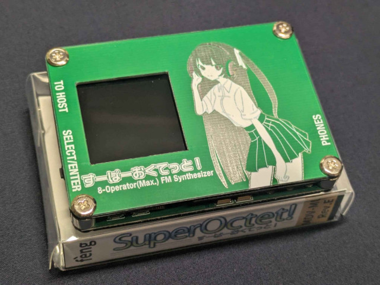

# はじめに

!!! danger inline end "注意事項"

    本機器は開発段階であり、今後ハードウェア・ソフトウェア双方が大幅な変更されることがあります

    現在、GM Level1準拠のデータ再生はできますが多くの機能が未実装です

<button type="button" class="btn btn-danger" style="display:block;margin:auto" onclick="window.location.href='https://feng-elec.booth.pm/items/5573638'">Boothで購入する</button>

本文書では「すーぱーおくてっと！」(以下本音源の)使用方法について記述します。

## 「すーぱーおくてっと！」とは？

MiniDVテープサイズ(W×H×D=66x48x12[mm])のMIDI音源です。

音源部には8オペレータのソフトウェアFM音源を使用しており、最大32和音(メロディー24音/リズム8音)を鳴らすことができます。

また、MMX(Multi Module eXtension)機能を搭載しているのでスタックするだけで発音数を増加させることができます。

## 本音源の特徴

- MiniDVテープサイズで非常に小型

- 往年のFM音源よりパワーアップしたソフトウェアFM音源による豪華な音色
    - 最大8オペレータ、フリーアルゴリズム

- USB-Cケーブル一本で接続可能
    - 対応環境ではドライバ不要で認識されます

- GM Level1に一部準拠
    - 既存のデータを活用できます

- スタックすることにより発音数を増加
    - MMX(Multi Module eXtension)と呼んでいます

## 動作確認環境

- Windows 7/8.1/10/11
    - Windows XP以前では動作しません

- Ubuntu 22.04

- MacOS X 10.5以降
    - PowerPC/Intel両方で動作確認

## 仕様

!!! warning inline end "情報"

    今後仕様変更の可能性があります、ご注意ください。

|仕様項目      |詳細                                                            |
|--------------|----------------------------------------------------------------|
|音源方式      |8オペレータソフトウェアFM音源 htsfmsサブセット               |
|プリセット音色|メロディ128種類×3バンク(重複あり) ドラムセット1種類 GM配列|
|パート数      |16パート                                                        |
|最大同時発音数|メロディー24音 リズム8音                                     |
|エフェクト    |5バンド全体EQ DAC内蔵フィルタブロックによる                  |
|コネクタ      |USB-C 3.5mmステレオジャック                                  |
|出力仕様      |ステレオ16bit/32kHz                                             |
|ディスプレイ  |1.3インチ TFT液晶                                               |
|電源          |USBバスパワー駆動                                               |
|サイズ(W×H×D) |66x48x12[mm]                                                    |
|本体重量      |To Be Measured                                                  |
|消費電流      |定常時0.75W(5V150mA)/ユニット                                   |

## 免責事項

- 本機器により何らかの損害を被ったとしても当方は責任を負いません
- 本機器のリバースエンジニアリング・複製・販売を一切禁じます
- 本機器の転売を禁じます、正規の方法以外で入手されたものについては一切対応しません
- 本機器の改造を禁じます